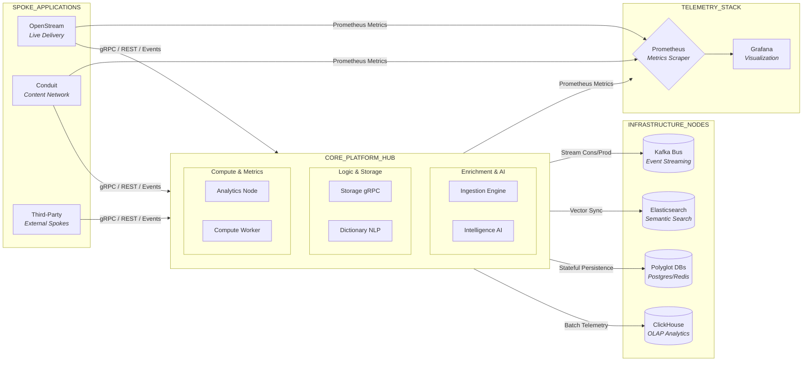

# OCTANEBREW PLATFORM

**Status:** `OPERATIONAL` // **Version:** `2026.02`

The **OctaneBrew Platform** is the high-performance administrative command center and shared infrastructure backbone for the OctaneBrew ecosystem. It employs a **Hub-and-Spoke Architecture**, where a centralized "Core Hub" provides critical multi-tenant services (AI, Storage, Event Streaming, Ingestion) to decentralized "Spoke Applications" like **OpenStream** and **Conduit**.

---

## 1. System Architecture: Hub & Spoke

The platform is engineered to prevent infrastructure bloat by consolidating heavy-lift logic into a single resilient hub while allowing spokes to remain lean and deployment-agnostic.



---

## 2. Shared Core Engines

Each service in the `./services` directory serves a specific architectural role within the hub.

| Engine | Directory | Role | Tech Stack |
| :--- | :--- | :--- | :--- |
| **Ingestion** | [`/ingestion`](./services/ingestion/README.md) | Two-Pass content enrichment & vector indexing. | Kafka, FastAPI, ES |
| **Intelligence** | [`/intelligence`](./services/intelligence/README.md) | Standardized LLM gateway & reranking hub. | Gemini, OpenAI, FlashRank |
| **Dictionary** | [`/dictionary-service`](./services/dictionary-service/README.md) | Linguistic analysis & grammar validation. | JamDict, NLTK, Redis |
| **Storage** | [`/storage-service`](./services/storage-service/README.md) | Multi-tenant gRPC/S3 object orchestration. | MinIO, NestJS, gRPC |
| **Analytics*** | [`/analytics`](./services/analytics/README.md) | ClickHouse-backed event telemetry warehouse. | ClickHouse, KafkaJS |
| **Compute** | [`/ffmpeg-worker`](./services/ffmpeg-worker/README.md) | Headless FFmpeg transcoding & worker mesh. | FFmpeg, NestJS, Kafka |

---

## 3. Infrastructure & Spoke Integration

### Network Topology
All services communicate over the internal `octane-net` overlay. External spokes connect to the hub via the **Nginx Gateway** or direct network attachment.

### Integration Contracts
*   **Event Bus**: Spokes produce to `octane.ingest.requests` for multi-stage enrichment.
*   **gRPC**: Used for high-speed binary transfers (Storage) and linguistic lookups.
*   **REST**: Unified API gateway for AI completions and semantic search endpoints.

---

## 4. Deployment & Observability

### Rapid Startup
The platform utilizes `uv` for hyper-fast Python dependency management and Docker layer caching.

```bash
# Pull and start the entire hub
docker-compose up -d --build
```

### Telemetry Nodes
*   **Grafana**: `https://grafana.octanebrew.dev` (System Health)
*   **Kafka UI**: `https://kafka.octanebrew.dev` (Event Stream Inspection)
*   **Kibana**: `https://kibana.octanebrew.dev` (Data Discovery)
*   **Dozzle**: `https://dozzle.octanebrew.dev` (Real-time Logs)

---

## 5. Development Standards

*   **Zero Data Loss**: Guaranteed by the Persistent Oplog pattern in the Ingestion Engine.
*   **Elastic Scaling**: Headless compute workers (FFmpeg) scale horizontally via Kafka consumer groups.
*   **Polyglot Persistence**: The right tool for the job (Postgres for State, ES for Search, ClickHouse for Analytics).
