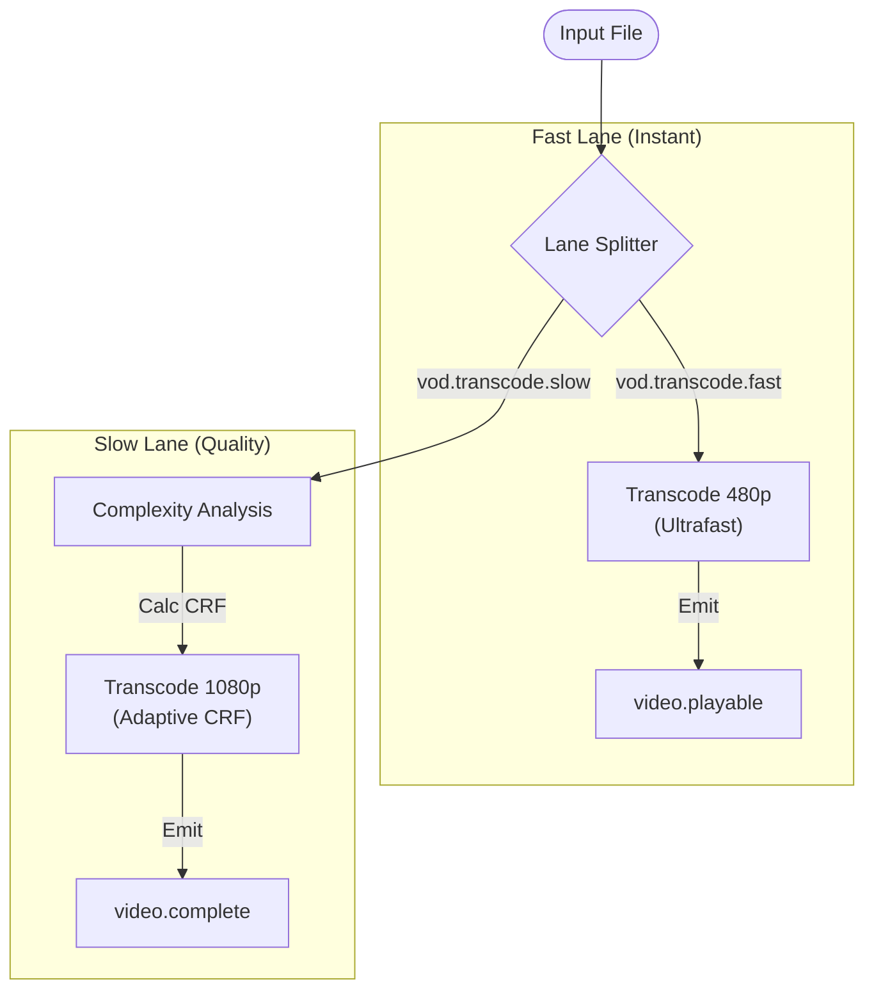

# FFmpeg Worker Service

A dedicated, stateless microservice for video transcoding and thumbnail generation (VOD processing) in the OctaneBrew platform.

## Overview

This worker is a high-performance media transcoding engine. It implements a **Split-Lane DAG (Directed Acyclic Graph)** architecture to balance instant user feedback with long-term storage efficiency.

## Smart Pipeline Architecture

The worker operates on two distinct logical lanes, allowing for prioritized processing and horizontal scaling:



1.  **Fast Lane (`vod.transcode.fast`)**:
    *   **Goal**: Instant gratification (~30s turnaround).
    *   **Action**: Generates thumbnail + 480p HLS rendition using `ultrafast` preset.
    *   **Event**: Emits `video.playable` to unblock viewer access.
2.  **Slow Lane (`vod.transcode.slow`)**:
    *   **Goal**: Per-title quality and bitrate optimization.
    *   **Analysis**: Samples video to calculate **Motion Complexity** (I-frame ratio).
    *   **Action**: Transcodes 720p/1080p using **Adaptive CRF** (22-28).
    *   **Event**: Emits `video.complete` and generates final Master Playback manifest.

### Parallel Scaling & Tuning
The worker can be tuned via the `PROCESS_LANE` environment variable (values: `fast`, `slow`, or `all`). This allows deploying dedicated pools of "Fast Lane" workers to ensure instant playability never queues behind long 1080p encodes.

---

## Deep Dive: Complexity Analysis

The `Slow Lane` (High Quality) pipeline uses a **per-title encoding optimization**:

1.  **Sampling**: FFmpeg scans the first 30 seconds of the source video.
2.  **Motion Calculation**: We calculate the ratio of **I-Frames** (Keyframes) to **P/B-Frames** (Delta frames).
    *   *High Motion* (Gaming/Sports) = Low I-Frame ratio -> Needs higher bitrate (lower CRF).
    *   *Low Motion* (Vlogs/Talk) = High I-Frame ratio -> Can save bitrate (higher CRF).
3.  **Adaptive CRF**: The worker selects a Constant Rate Factor between **22** (Quality) and **28** (Efficiency) based on this score.

---

## Scaling Strategy (Docker Compose)

To handle high throughput, run separate worker pools for each lane:

```yaml
services:
  # 🐇 Fast Lane: High responsiveness, lower resource usage per job
  worker-fast:
    image: ffmpeg-worker
    environment:
      - PROCESS_LANE=fast
    deploy:
      replicas: 2
      resources:
        limits:
          cpus: '2'

  # 🐢 Slow Lane: High quality, heavy CPU usage
  worker-slow:
    image: ffmpeg-worker
    environment:
      - PROCESS_LANE=slow
    deploy:
      replicas: 5
      resources:
        limits:
          cpus: '4'
```

---

## Event Reference

### Input: `vod.transcode.*`
```json
{
  "videoId": "uuid",
  "storagePath": "uploads/user/session/file.mp4",
  "bucket": "openstream-uploads"
}
```

### Output: `video.playable` (Fast Lane)
```json
{
  "videoId": "uuid",
  "hlsManifest480p": "s3://.../master.m3u8",
  "thumbnailUrl": "s3://.../thumb.jpg",
  "duration": 120
}
```

### Output: `video.complete` (Slow Lane)
```json
{
  "videoId": "uuid",
  "resolutions": ["480p", "720p", "1080p"],
  "crfUsed": 24,
  "complexityScore": 0.65
}
```

## Prerequisites

- **Node.js** (v20+)
- **FFmpeg** (v4+) installed on the host/container.
- **Kafka** (Running broker).
- **Shared Volume**: Must have access to the same storage path as the backend/ingest service.

## Environment Variables

| Variable | Description | Default |
| :--- | :--- | :--- |
| `KAFKA_BROKERS` | Kafka Connection String | `broker.octanebrew.dev:9092` |
| `OPENSTREAM_VOL_PATH` | Base path for media files (MinIO mount) | `/minio_data` |
| `VOD_WORK_DIR` | Local scratch space for transcoding | `/tmp/vod-work` |
| `PROCESS_LANE` | Lane affinity filter (`fast`, `slow`, `all`) | `all` |
| `FFMPEG_PATH` | Path to FFmpeg binary | `ffmpeg` |

## Installation

```bash
$ npm install
```

## Running the app

```bash
# development
$ npm run start

# watch mode
$ npm run start:dev

# production mode
$ npm run start:prod
```