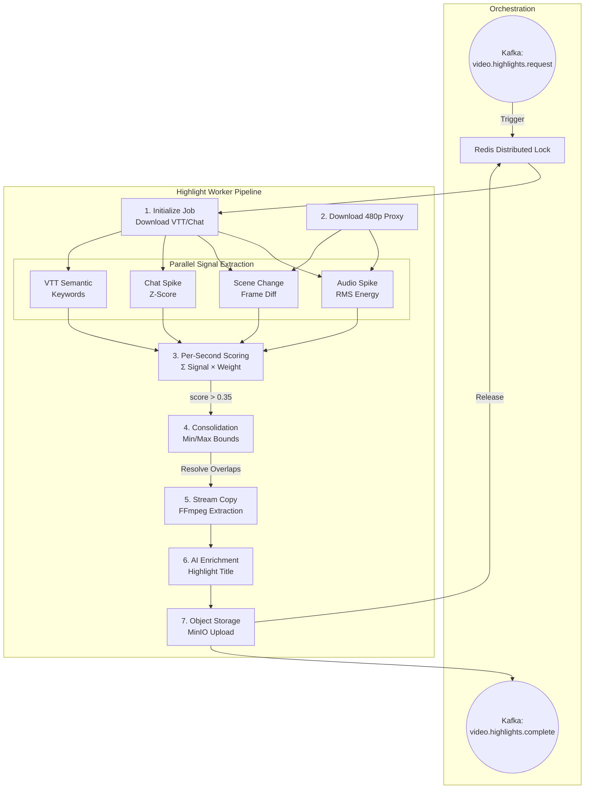

# Highlight Worker

> Automatic highlight clip generator for OpenStream VOD content.
> Part of the [Content Intelligence Layer](../../../openstream-backend/docs/content-intelligence-layer.md).

---

## Overview

The Highlight Worker is a **Python 3.12** service that analyzes uploaded videos and automatically extracts non-overlapping highlight clips using CPU-only signal analysis. It runs as an independent container with strict resource limits (1 CPU, 1 GB RAM) and is triggered via Kafka after slow lane transcoding completes.

## Architecture



## Project Structure

```
highlight-worker/
├── config/
│   └── highlight_config.yaml    # Default signal weights & thresholds
├── src/highlight_worker/
│   ├── __init__.py
│   ├── main.py                  # Kafka consumer entry point
│   ├── config.py                # Settings (env vars + YAML merge)
│   ├── job.py                   # Job orchestrator
│   ├── scoring.py               # Per-second weighted scoring
│   ├── consolidation.py         # Cluster merging & clip planning
│   ├── extraction.py            # FFmpeg stream-copy extraction
│   ├── enrichment.py            # Intelligence Service titles
│   ├── storage.py               # MinIO upload
│   ├── governance.py            # CPU/memory self-throttling
│   ├── lock.py                  # Redis distributed lock
│   ├── metrics.py               # Prometheus metric definitions
│   └── signals/
│       ├── __init__.py          # SignalModule base class
│       ├── audio_spike.py       # FFmpeg astats RMS detection
│       ├── scene_change.py      # FFmpeg select filter
│       ├── chat_spike.py        # chat.json bucket analysis
│       ├── ocr_keyword.py       # Tesseract OCR frame analysis
│       └── vtt_semantic.py      # VTT keyword/entity detection
├── tests/
│   ├── conftest.py
│   ├── test_scoring.py          # 13 tests
│   ├── test_consolidation.py    # 12 tests
│   └── test_config.py           # 11 tests
├── Dockerfile
└── pyproject.toml
```

## Quick Start

### Development

```bash
# Install dependencies
uv sync

# Run tests
PYTHONPATH=src uv run pytest tests/ -v

# Run locally (requires Kafka, MinIO, Redis)
uv run python -m highlight_worker
```

### Docker

```bash
# Build
docker build -t highlight-worker .

# Run with environment
docker run --rm \
  -e KAFKA_BOOTSTRAP_SERVERS=kafka:29092 \
  -e MINIO_ENDPOINT=minio:9000 \
  -e MINIO_ROOT_USER=admin \
  -e MINIO_ROOT_PASSWORD=secret \
  -e REDIS_URL=redis://redis:6379 \
  -e INTELLIGENCE_SVC_URL=http://intelligence:8000 \
  highlight-worker
```

### Docker Compose

The service is included in the platform `docker-compose.yml`:

```bash
docker compose up -d highlight-worker
```

## The Extraction Algorithm & Signals

The service uses a deterministic, multi-modal signal analysis algorithm to pinpoint peaks of interest. Each signal module is isolated — if one fails (e.g., missing VTT), the others continue gracefully:

### 1. The Signals

| Signal Module | Base Weight | Data Source | Detection Mechanism |
|---------------|-------------|-------------|---------------------|
| **Audio Spike** | 0.30 | 480p proxy | Optimized **O(N)** sliding window RMS energy detection. Spikes above the adaptive rolling z-score denote loud moments (cheering, screaming). |
| **Scene Change** | 0.25 | 480p proxy | On-the-fly parsing of FFmpeg `scdet` scores. High scores correlate with rapid camera movement or dramatic visual transitions. |
| **Chat Spike** | 0.20 | `chat.json` | Groups historical chat messages into discrete time buckets. Identifies moments where message frequency exceeds the z-score threshold. |
| **VTT Semantic** | 0.10 | `en.vtt` | Optimized **O(N)** keyword and entity detection. Scans the WebVTT transcript for emotional/impact keywords (e.g., "wow", "crazy", "win"). |
| **OCR Keyword** | 0.15 | 480p proxy | Extracts 1 FPS image frames, passing them through Tesseract OCR to detect on-screen text events ("Victory", "Goal"). |

### 2. The Scoring Formula

For every single second `t` in the video, a normalized score is calculated:

```
score[t] = Σ (signal_score[t] × normalized_signal_weight)
```

Seconds where `score ≥ qualification_threshold` (default: `0.35`) are flagged as "Qualified Peaks". 

### 3. Consolidation & Clustering

Because adjacent seconds often spike together, the algorithm applies a **clustering pass**:
1. Groups consecutive qualified seconds into "Events".
2. Merges Events that are closer than the `context_buffer` (default 3s).
3. Expands the Event boundaries by padding the start and end to meet the `min_clip_duration` (default 8s), creating the final "Clip".
4. Resolves overlaps: If two clips overlap, the one with the higher peak aggregate score absorbs the other.
5. Sorts the finalized non-overlapping clips by score, taking only the top `N` (default `max_clips: 5`).

## Configuration

Configuration is loaded from `highlight_config.yaml` with environment variable overrides. See [config reference](../../../openstream-backend/docs/content-intelligence-layer.md#10-configuration-reference).

Key tunable parameters:

| Parameter | Default | Effect |
|-----------|---------|--------|
| `scoring.qualification_threshold` | 0.35 | Higher = fewer, more confident clips |
| `scoring.max_clips` | 5 | Hard cap on output clips |
| `scoring.min_clip_duration` | 8s | Minimum clip length |
| `scoring.max_clip_duration` | 60s | Maximum clip length |
| `scoring.context_buffer` | 3s | Padding before/after peak |
| `governance.max_cpu_percent` | 60 | Self-throttle threshold |

## Environment Variables

| Variable | Required | Default | Description |
|----------|----------|---------|-------------|
| `KAFKA_BOOTSTRAP_SERVERS` | Yes | — | Kafka broker address |
| `KAFKA_GROUP_ID` | Yes | `highlight-worker` | Consumer group ID |
| `MINIO_ENDPOINT` | Yes | `minio:9000` | MinIO server |
| `MINIO_ROOT_USER` | Yes | — | MinIO access key |
| `MINIO_ROOT_PASSWORD` | Yes | — | MinIO secret key |
| `REDIS_URL` | Yes | `redis://redis:6379` | Redis for distributed locks |
| `INTELLIGENCE_SVC_URL` | Yes | — | Intelligence Service URL |
| `SERVICE_API_KEY` | | — | Intelligence API key |
| `MAX_CPU_PERCENT` | | `60` | CPU self-throttle % |
| `MAX_MEMORY_MB` | | `900` | Memory limit in MB |
| `JOB_TIMEOUT_SECONDS` | | `7200` | Max job duration |
| `LOG_LEVEL` | | `INFO` | Logging level |

## Resource Governance & Guardrails

The service enforces strict safety mechanisms to ensure it never crashes the host machine or hallucinates data:

### 1. Hardware Throttling & Stability
- **Container Limit:** Hardcapped at 1 CPU core, 1 GB RAM (via Docker).
- **Self-Throttle:** A `governance.py` daemon thread polls `psutil.cpu_percent()` every 10 seconds. If the CPU exceeds `MAX_CPU_PERCENT` (default 85%), the worker sleeps its processing loop to cool the system down.
- **Async Processing:** All algorithmic bottlenecks (Rolling Z-Score, Window Aggregation, Consolidation) use **O(N) optimized sliding windows** and explicitly yield to the event loop. This ensures consistent Kafka heartbeats even during 10+ hour VOD analysis.
- **Process Priority:** Internal FFmpeg subprocesses are invoked with `nice -n 10` to yield to essential host processes.
- **Analysis Target:** All visual analysis runs exclusively against the lightweight 480p Fast Lane proxy, avoiding the massive memory overhead of decoding 1080p source files.

### 2. Hallucination Prevention (Enrichment)
After a clip is physically extracted, it is enriched with a title via the Intelligence Service (Intelligence Svc). To strictly prevent AI hallucinations:
- **Rich Context Injection**: We pass down the parent video's `Title`, `Description`, and `Category` alongside the `en.vtt` transcript snippet.
- **Strict Prompting**: The System Prompt explicitly instructs the LLM: *"Do NOT guess the game, topic, or people unless explicitly stated in the context or transcript. If insufficient context exists, generate a generic descriptive title (e.g., "Exciting Moment") rather than hallucinating facts."*

## Prometheus Metrics

Available at `http://localhost:8002/metrics`:

| Metric | Type | Description |
|--------|------|-------------|
| `octane_highlight_jobs_total` | Counter | Jobs by outcome |
| `octane_highlight_job_seconds` | Histogram | End-to-end duration |
| `octane_highlight_clips_total` | Counter | Total clips extracted |
| `octane_highlight_signal_seconds` | Histogram | Per-signal latency |
| `octane_highlight_throttle_total` | Counter | Self-throttle events |
| `openstream_highlight_signal_failures_total` | Counter | Module failures |
| `openstream_highlight_vtt_used_total` | Counter | VTT signal availability |
| `openstream_highlight_intelligence_calls_total` | Counter | Intelligence calls |

## Testing

```bash
# Run all tests
PYTHONPATH=src uv run pytest tests/ -v

# Run specific test file
PYTHONPATH=src uv run pytest tests/test_scoring.py -v

# Run with coverage
PYTHONPATH=src uv run pytest tests/ --cov=highlight_worker --cov-report=term
```

### Test Coverage

- **Scoring** — weighted computation, qualification threshold, edge cases
- **Consolidation** — cluster merging, non-overlap, duration constraints, max_clips cap
- **Config** — default values, YAML loading, missing file fallback

## Health Check

The worker touches `/tmp/healthy` every 30 seconds for Docker health checks:

```yaml
healthcheck:
  test: ["CMD", "test", "-f", "/tmp/healthy"]
  interval: 30s
  timeout: 5s
  retries: 3
```

## License

Internal — OctaneBrew Platform
