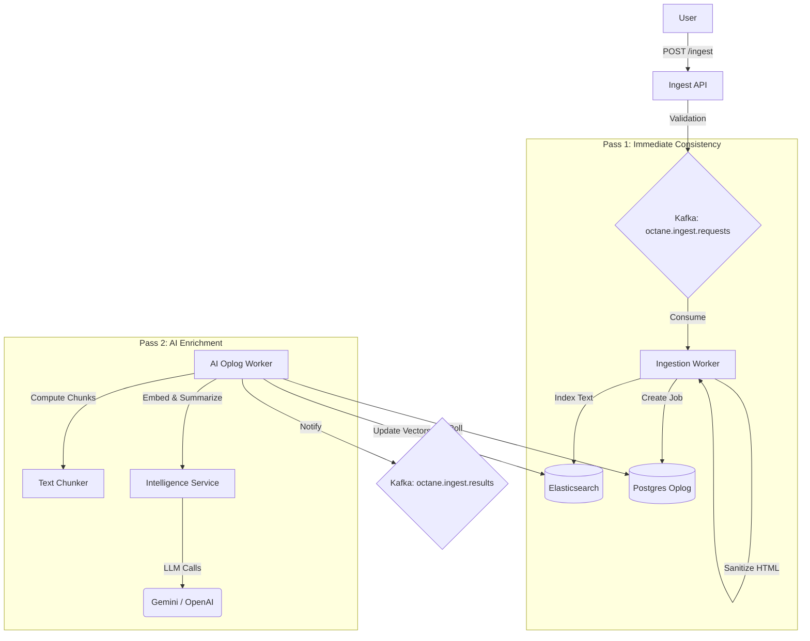

# Ingestion Service (`ingestion`)

## 1. System Overview

The **Ingestion Service** is the high-throughput entry point for content into the OctaneBrew platform. It transforms unstructured data (articles, video transcripts, raw HTML) into structured, biologically-inspired "knowledge atoms" (vectors) optimized for semantic search and retrieval augmented generation (RAG).

It employs a **Two-Pass Architecture** coupled with a **Persistent Oplog** pattern. This ensures:
1.  **Zero Data Loss**: Even if AI providers (OpenAI/Gemini) are down, content is safely captured.
2.  **Instant Availability**: Content is searchable by keyword immediately (Pass 1), while vectors arrive asynchronously (Pass 2).
3.  **Resiliency**: Failed AI jobs are automatically retried with exponential backoff.

---

## 2. Design Decisions: Multiple workers for scalability and resiliency

### A. Separation of Concerns (Scalability)
*   **Ingestion API (`ingestion-svc`)**: An **I/O bound** service. It accepts HTTP requests and acknowledges them immediately by pushing to Kafka.
*   **Ingestion Worker (`ingestion-worker`)**: A **CPU bound** consumer. It handles HTML sanitization and immediate text indexing.
*   **AI Oplog Worker (`ai-oplog-worker`)**: A **Latency bound** worker. LLM calls are slow. By isolating them, valid text is searchable *instantly*, while vectors arrive whenever the AI finishes.

### B. Artifact Strategy (Single Docker Image)
All three components share the **same Docker image** for simplified deployment but execute specialized entrypoints:
*   **API**: `uvicorn ingestion.main:app`
*   **Worker**: `python -m ingestion.consumer`
*   **AI Worker**: `python -m ingestion.worker`

---

## 3. Project Structure 

The service follows a modular design pattern for high maintainability.

```text
src/ingestion/
├── core/                   # Infrastructure & Shared Internal Logic
│   ├── lifespan.py         # Async Lifecycle (Redis, Kafka, ES init)
│   ├── limiter.py          # Token Bucket Rate Limiter (Lua-backed)
│   ├── observability.py    # Metrics (Prometheus) & Tracing (OTel)
│   └── security.py         # API Key Authentication
├── routers/                # API Endpoint Logic
│   ├── ingest.py           # Content Ingestion (POST /ingest)
│   └── search.py           # Hybrid Search (POST /search)
├── processors/             # Domain Logic (Sanitization, Chunks, AI)
├── models.py               # Pydantic Schemas
├── config.py               # Environment Configuration
└── main.py                 # Minimalist Entry Point
```

---

## 4. Architecture & Flow



---

## 5. Resiliency & Reliability

*   **Persistent Oplog**: The `ai_oplog` table acts as a reliable state machine. All AI tasks start as `PENDING`.
*   **Exponential Backoff**: Failed jobs retry using `delay = 2^retry_count * 60 seconds`.
*   **Token Bucket Rate Limiting**: 
    *   `POST /search` is limited to **300 requests/minute** (burst support up to capacity).
    *   Implementation uses atomic Redis Lua scripts for accuracy.
    *   Inspect state: `docker exec redis redis-cli HGETALL "rate_limit:search:<CLIENT_IP>"`

---

## 6. Key Technical Features

### A. Entity-Aware Summarization
The system uses specialized prompts in `src/ingestion/processors/prompts.py`:
*   **Video Transcripts**: Focuses on "Key Moments" and "Topics".
*   **Articles**: Focuses on "Thesis" and "Key Concepts".
*   **Default**: Generic and concise for summarization.

### B. Hybrid Search (Keyword + Vector)
Utilizes **Linear Boosted Hybrid Search** to combine semantic vector scores with traditional BM25 keyword rankings.

---

## 7. API Reference

### `POST /ingest`
Queues content for processing. Requires `X-API-KEY`.

```json
{
  "trace_id": "uuid-1234",
  "source_app": "conduit",
  "entity_id": "video-999",
  "entity_type": "video_transcript", 
  "operation": "index",
  "timestamp": "2024-02-14T12:00:00Z",
  "payload": {
    "title": "Deep Dive into Kafka",
    "content": "Speaker 1: Welcome to the stream...",
    "url": "https://..."
  },
  "enrichments": ["summary"]
}
```

### `POST /search`
Performs Hybrid Search. Rate limit: 60/min.

```json
{
  "query": "kafka architecture",
  "limit": 10,
  "filters": { "entity_type": "video_transcript" },
  "use_hybrid": true,
  "return_chunks": true
}
```

---

## 8. Configuration

| Variable | Default/Description |
|----------|---------------------|
| `KAFKA_BOOTSTRAP_SERVERS` | Kafka Broker address |
| `ES_HOST` | Elasticsearch URL |
| `SERVICE_API_KEY` | Shared Internal Auth Key |
| `SUMMARY_MODEL` | Maps to Gemini 1.5 Flash by default |
| `EMBEDDING_MODEL` | `models/gemini-embedding-001` |
| `REDIS_URL` | Redis for Rate Limiting |

---