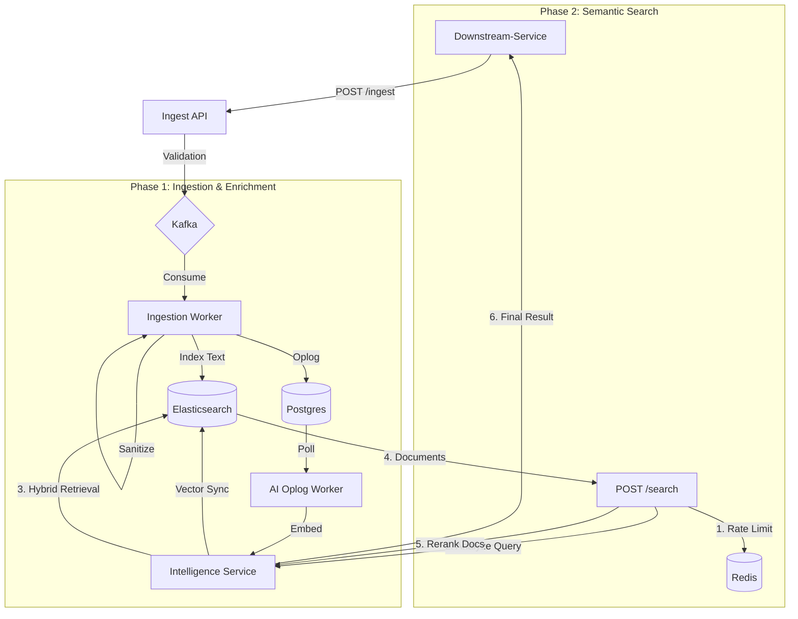

# Ingestion Service (`ingestion`)

## 1. System Overview

The **Ingestion Service** is the high-throughput entry point for content into the OctaneBrew platform. It transforms unstructured data (articles, video transcripts, raw HTML) into structured, biologically-inspired "knowledge atoms" (vectors) optimized for semantic search and retrieval augmented generation (RAG).

It employs a **Hybrid Processing Pipeline** that combines immediate keyword indexing with asynchronous AI enrichment and multi-phase semantic search retrieval.

---

## 2. Design Decisions: Scalability and Resiliency

### A. Two-Pass Architecture
1.  **Pass 1 (Immediate)**: Content is sanitized and indexed into Elasticsearch for instant keyword search.
2.  **Pass 2 (Asynchronous)**: AI Oplog Worker polls Postgres for pending tasks, computes embeddings via the Intelligence service, and updates the vector space.

### B. Multi-Phase Search Path
To ensure high recall and precision, the search engine utilizes:
*   **Query Intelligence**: Detects language, translates non-English queries, and extracts entities for boosting.
*   **Hybrid Retrieval**: Combines BM25 keyword scores and kNN vector scores.
*   **Cross-Encoder Reranking**: Re-orders the top results using a deep semantic model to filter out false positives.

---

## 3. Project Structure 

```text
src/ingestion/
├── core/                   # Infrastructure
│   ├── lifespan.py         # Async Lifecycle
│   ├── limiter.py          # Redis Rate Limiter
│   └── observability.py    # Metrics (Prometheus) & Tracing (OTel)
├── routers/                # API Logic
│   ├── ingest.py           # Content Ingestion
│   └── search.py           # Multi-Phase Semantic Search
├── processors/             # Domain Logic
│   ├── indexer.py          # Elasticsearch Sync Logic
│   ├── intelligence.py     # AI Client Wrapper
│   └── prompts.py          # Specialized AI Instructions
├── models.py               # Pydantic Schemas
└── config.py               # System Configuration
```

---

## 4. Architecture & Flow



---

## 5. Resilience & Infrastructure Stability

The Ingestion service acts as the platform's primary shield, ensuring that high-volume content ingestion or search spikes do not degrade the core infrastructure.

### A. Distributed Rate Limiting (Token Bucket)
To protect Elasticsearch and upstream Intelligence resources, the `/search` and `/ingest` endpoints utilize a Redis-backed **Token Bucket** algorithm.
*   **Lua-Powered Accuracy**: Uses atomic Redis Lua scripts to ensure consistency across multiple API instances.
*   **Burst Support**: Allows for temporary traffic bursts up to bucket capacity while maintaining a steady-state refill rate.
*   **Client Isolation**: Prevents a single "noisy neighbor" (e.g., a specific spoke app) from exhausting global platform resources.

### B. Persistent Oplog Pattern
AI enrichment is decoupled from the primary ingestion flow via a Postgres-backed **Oplog**. This ensures:
*   **Zero Data Loss**: Content is safely stored in Postgres even if AI providers are unreachable.
*   **Recoverability**: Failed jobs are automatically retried with exponential backoff.
*   **Stateful Tracking**: Every enrichment step is versioned and trackable through the system logs.

---

## 6. Key Technical Features

### A. Advanced Search Optimization
*   **Vector Thresholding**: Drops vector matches below a certain cosine similarity to maintain relevancy.
*   **Entity Boosting**: Increases the score of documents containing entities extracted from the query.
*   **Flash-Reranking**: Integrates cross-encoders to achieve "state-of-the-art" precision in the top 10 results.

### B. Resilience & Reliability
*   **Exponential Backoff**: Failed AI jobs are automatically retried via the Oplog state machine.
*   **I/O Isolation**: API is non-blocking; the heavy lifting occurs in workers isolated by Kafka topics.

---

## 6. API Reference

### `POST /ingest`
Queues content for processing. Requires `X-API-KEY`.

```json
{
  "trace_id": "uuid-1234",
  "source_app": "conduit",
  "entity_id": "video-999",
  "entity_type": "video_transcript", 
  "operation": "index",
  "timestamp": "2024-02-14T12:00:00Z",
  "payload": {
    "title": "Deep Dive into Kafka",
    "content": "Speaker 1: Welcome to the stream...",
    "url": "https://..."
  },
  "enrichments": ["summary", "vectors"]
}
```

### `POST /search`
Performs Multi-Phase Hybrid Search.

**Payload:**
```json
{
  "query": "kafka architecture",
  "limit": 10,
  "use_hybrid": true,
  "enable_query_analysis": true,
  "enable_reranking": true,
  "min_score": 25.0,
  "vector_threshold": 0.65
}
```

---

## 7. Configuration

| Variable | Default/Description |
|----------|---------------------|
| `KAFKA_BOOTSTRAP_SERVERS` | Kafka Broker address |
| `ES_HOST` | Elasticsearch URL |
| `INTELLIGENCE_URL` | Endpoint for AI Orchestrator |
| `SEARCH_RATE_LIMIT` | Requests per minute (default: 60) |

---