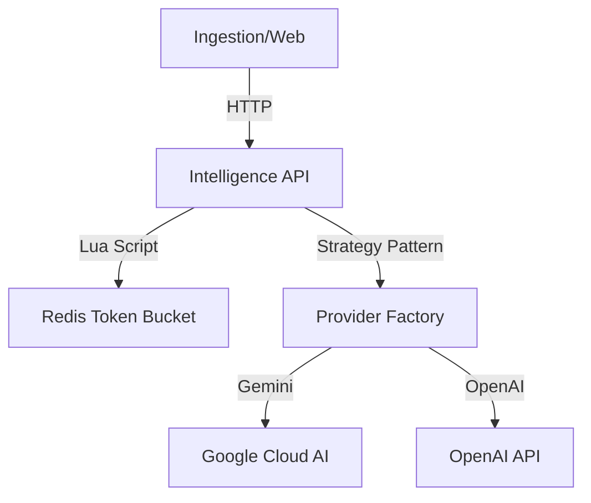

# Intelligence Service (`intelligence`)

## Overview
The **Intelligence Service** is the central AI Orchestrator for the OctaneBrew platform. It abstracts complex LLM operations behind a standardized API, handling provider strategy, rate limiting, and observability.

**Role**: AI Gateway, Embeddings Provider, Semantic Analyzer.

---

## 1. Project Structure (Modular Design)

The service utilizes a modular "Senior Architect" pattern for extensibility.

```text
src/intelligence/
├── core/                   # Shared Infrastructure
│   ├── lifespan.py         # Lifecycle Management (Redis Init)
│   ├── limiter.py          # Token Bucket Algorithm (Redis Lua)
│   ├── observability.py    # Metrics (Prometheus) & Tracing (OTel)
│   ├── factory.py          # AI Provider Strategy Pattern
│   └── interfaces.py       # Abstract Base Classes for AI
├── routers/                # API Endpoints
│   ├── chat.py             # Chat Completions (POST /v1/chat/completions)
│   └── embeddings.py       # Vector Generation (POST /v1/embeddings)
├── providers/              # LLM Implementations (OpenAI, Gemini)
├── config.py               # Settings & Model Mapping
└── main.py                 # Clean Entry Point
```

---

## 2. Architecture



---

## 3. Rate Limiting (Token Bucket)

The service protects upstream quotas using a **Token Bucket** algorithm implemented in a Redis Lua script.

*   **Logic**:
    *   **Endpoint**: `/v1/chat/completions`
    *   **Capacity**: 50 tokens (Burst support).
    *   **Refill**: 0.83 tokens/sec (50 per minute).
*   **Identification**: Uses `X-App-ID` header (e.g., `ingestion`, `openstream`) or client IP.
*   **Inspection**: `docker exec redis redis-cli HGETALL "rate_limit:chat:<ID>"`

---

## 4. API Reference

### A. Chat Completions
**Endpoint**: `POST /v1/chat/completions`

#### Request
```json
{
  "model": "gpt-4o", 
  "prompt": "Explain Kafka in one sentence.",
  "system": "You are a helpful assistant."
}
```

#### Response
```json
{
  "content": "Kafka is a distributed event streaming platform used for building real-time data pipelines.",
  "provider": "OpenAIProvider"
}
```

### B. Embeddings
**Endpoint**: `POST /v1/embeddings`
**Description**: Generates vector embeddings.

---

## 5. Configuration

| Env Var | Default | Description |
|---------|---------|-------------|
| `ACTIVE_PROVIDER` | `gemini` | Current default LLM provider |
| `GOOGLE_API_KEY` | - | Gemini API Key |
| `OPENAI_API_KEY` | - | OpenAI API Key |
| `AI_MODELS` | (JSON) | Model capability registry |
| `REDIS_URL` | `redis://redis:6379` | Rate Limiter backend |

---

## 6. Observability

- **Metrics**: `http://localhost:8000/metrics` (Prometheus format).
- **Tracing**: OpenTelemetry (Propagates `trace_id` from Ingestion API).

---

## 7. Testing
```bash
# Run localized unit tests
uv run pytest tests/
```
