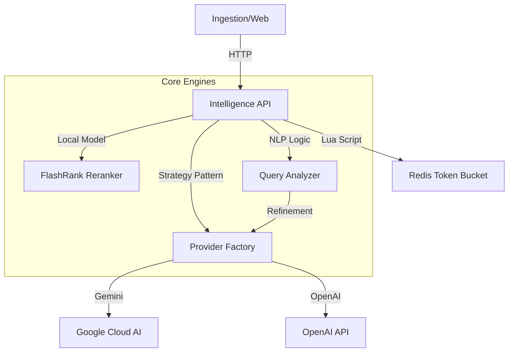

# Intelligence Service (`intelligence`)

## Overview
The **Intelligence Service** is the central AI Orchestrator for the OctaneBrew platform. It abstracts complex LLM and NLP operations behind a standardized API, handling provider strategy, rate limiting, Reranking, and Semantic Query Intelligence.

**Role**: AI Gateway, Embeddings Provider, Cross-Encoder Reranker, Query Intelligence.

---

## 1. Project Structure (Modular Design)

The service utilizes a modular design pattern for extensibility, separating core infrastructure from routing logic.

```text
src/intelligence/
├── core/                   # Shared Infrastructure
│   ├── lifespan.py         # Lifecycle Management (Redis Init)
│   ├── limiter.py          # Token Bucket Algorithm (Redis Lua)
│   ├── observability.py    # Metrics (Prometheus) & Tracing (OTel)
│   ├── factory.py          # AI Provider Strategy Pattern
│   ├── reranker.py         # FlashRank Cross-Encoder Logic
│   └── analyzer.py         # Query Intent & Translation Logic
├── routers/                # API Endpoints
│   ├── chat.py             # Chat Completions
│   ├── embeddings.py       # Vector Generation
│   ├── rerank.py           # Cross-Encoder Reranking
│   └── query.py            # Query Analysis & Extraction
├── config.py               # Settings & Model Mapping
└── main.py                 # Clean Entry Point
```

---

## 2. Architecture



## 3. Resilience & Infrastructure Stability

The service is engineered for **Enterprise-Grade Stability**, ensuring that upstream AI provider quotas are never exceeded and that internal resources remain protected from search-bursts or malicious spikes.

### A. Redis-Backed Rate Limiting (Token Bucket)
Every critical endpoint is protected by a high-precision **Token Bucket** algorithm implemented via atomic Redis Lua scripts.
*   **Capacity & Refill**: Configurable per-tier (e.g., 60 tokens burst, refilling at 1/sec).
*   **Distributed State**: Rate limits are shared across all service instances, preventing "split-brain" quota exhaustion.
*   **Identification**: Identifies callers via `X-App-ID` (e.g., `ingestion`, `conduit`) or Client IP.
*   **Observability**: Real-time bucket status can be inspected: `docker exec redis redis-cli HGETALL "rate_limit:chat:<ID>"`.

### B. High-Performance Isolation
*   **Model Tiering**: Uses "fast" models for analysis and "advanced" models for complex chat, optimizing cost and latency.
*   **Stateless Scaling**: The gRPC and REST handlers are fully stateless, allowing horizontal scaling behind the Nginx hub.

---

## 4. Key Technical Features

### A. Cross-Encoder Reranking
Uses the **FlashRank** library to re-order search results by computing a deep semantic relevance score between the query and document snippets. This significantly improves precision by moving high-relevancy matches to the top.

### B. Query Intelligence
Parses unstructured queries to extract:
*   **Language Detection**: Automatic translation to English for better cross-lingual recall.
*   **Entity Extraction**: Identifies key names, products, or locations for keyword boosting.
*   **Intent Discovery**: Determines if the user is looking for a video, an article, or a direct answer.

---

## 4. API Reference

### A. Rerank
**Endpoint**: `POST /v1/rerank`
Re-orders a list of candidate documents.

```json
{
  "query": "kafka architecture",
  "documents": [
    { "id": 1, "text": "Basic Kafka intro..." },
    { "id": 2, "text": "Deep dive into Kafka brokers..." }
  ]
}
```

### B. Query Analysis
**Endpoint**: `POST /v1/analyze`
Extracts intent and expands synonyms.

```json
{
  "query": "who is the CEO of OctaneBrew?"
}
```

### C. Chat & Embeddings
*   `POST /v1/chat/completions`: Standardized LLM completions.
*   `POST /v1/embeddings`: Batch vector generation for indexing.

---

## 5. Configuration

| Env Var | Default | Description |
|---------|---------|-------------|
| `ACTIVE_PROVIDER` | `gemini` | Current default LLM provider |
| `RERANKER_MODEL` | `ms-marco-MiniLM-L-12-v2` | FlashRank model to use |
| `AI_MODELS` | (JSON) | Model capability registry |
| `REDIS_URL` | `redis://redis:6379` | Rate Limiter backend |

---

## 6. Observability

- **Metrics**: `http://localhost:8000/metrics` (Prometheus format).
- **Tracing**: OpenTelemetry support for end-to-end request tracking across ingestion and search.
