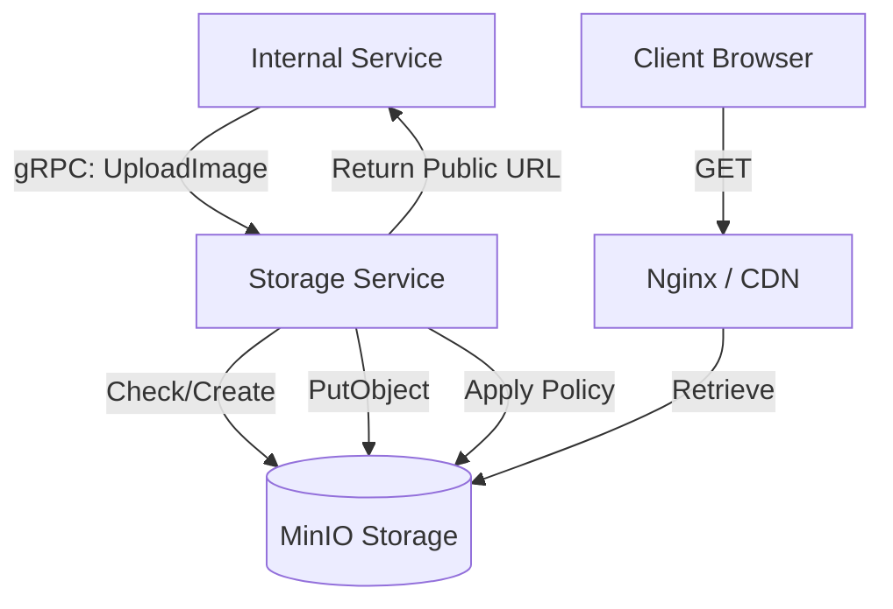

# Storage Service (`storage-service`)

## 1. System Overview

The **Storage Service** is an enterprise-grade, headless S3-compatible orchestrator for the OctaneBrew platform. It provides a unified gRPC interface for multi-tenant media management, abstracting the underlying object storage (MinIO) and ensuring strict security, bucket isolation, and high-performance retrieval.

By centralizing storage logic, the service automates:
1.  **Dynamic Provisioning**: Buckets are created on-the-fly when first requested.
2.  **Access Control**: Implements granular bucket policies (e.g., public read-only for thumbnails).
3.  **Presigned Security**: Generates time-limited URLs for private media retrieval.

---

## 2. Design Decisions

### A. gRPC for Internal Communication
Unlike public-facing services, Storage Service communicates via **gRPC** (port 50051). This minimizes latency for intra-cluster media transfers and provides strong typing for binary data (image buffers).

### B. Intelligent Signing
The service uses a **Double-Client Strategy**:
*   **Internal Client**: Communicates directly with MinIO via the Docker network.
*   **Signing Client**: Uses `STORAGE_PUBLIC_HOST` to generate URLs that are valid from the user's browser, respecting CDN/Proxy headers.

### C. Idempotent Policy Management
Every upload ensures the target bucket has the appropriate `PublicReadGetObject` policy, correcting any drift in infrastructure state automatically without manual S3 console intervention.

---

## 3. Project Structure

The service is built with **NestJS** and follows a standard microservice pattern.

```text
src/
├── app.module.ts          # Module orchestration
├── main.ts                # gRPC server entry point
├── s3.service.ts          # Core AWS-SDK v3 / MinIO logic
├── storage.controller.ts  # gRPC request handlers
└── storage.proto          # Protocol Buffer definitions
```

---

## 4. Architecture & Data Flow



---

## 5. API Reference (gRPC)

### `rpc UploadImage`
Uploads binary data to a specific bucket. Returns the final public URL.

**Request:**
```protobuf
{
  "filename": "cover.jpg",
  "data": "<bytes>",
  "bucket": "conduit-media",
  "mimeType": "image/jpeg"
}
```

### `rpc GetPresignedUrl`
Generates a temporary GET URL for private objects.

**Request:**
```protobuf
{
  "bucket": "conduit-private",
  "key": "user-invoice.pdf",
  "expiry": 3600
}
```

---

## 6. Configuration

| Variable | Default / Description |
|----------|-----------------------|
| `MINIO_ROOT_USER` | Admin username for MinIO |
| `MINIO_ROOT_PASSWORD` | Admin password for MinIO |
| `MINIO_ENDPOINT` | Internal MinIO host (e.g., `minio`) |
| `MINIO_PORT` | MinIO API port (default: `9000`) |
| `STORAGE_PUBLIC_HOST` | Public-facing domain for generated URLs |

---

## 7. Development & Testing

The service utilizes `uv` for lean dependency management in the Docker build process, but standard `npm` is used for NestJS logic.

```bash
# Install dependencies
npm install

# Build & Run (Production)
npm run build
npm run start:prod
```
